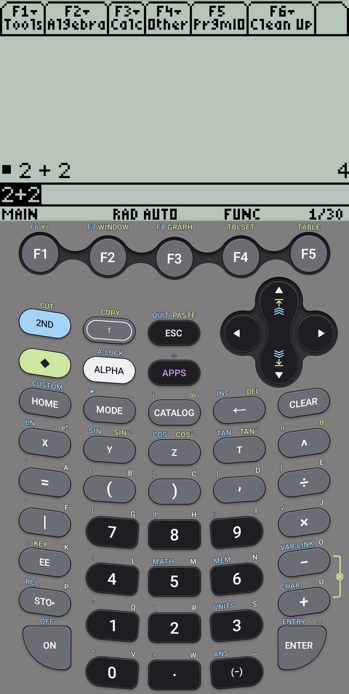
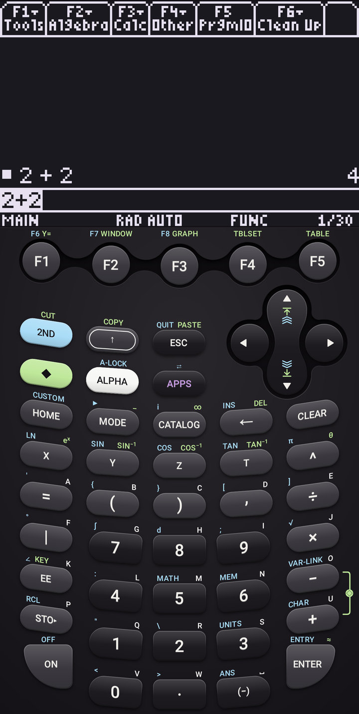

# Graph89 Remastered

Emulator for TI Series calculators (TI-89, TI-89 Titanium, TI-84 Plus, TI-84 Plus SE, TI-83, TI-83 Plus, TI-83 Plus SE). Rebuilt in Kotlin and updated to modern Android Material design standards. Based on Graph89 by Dritan Hashorva.

The app does not include any Texas Instruments software. You supply the OS or ROM of your own calculator.

<p align="center">
  
  &nbsp;
  
</p>
<p align="center"><em>TI-89 Titanium: Classic Skin and 3D Midnight Skin</em></p>

Disclaimer: I made this as a fun side project during my free time. Agentic development was used to help port legacy Java code into native Kotlin.

## Features

- File transfer
- Multiple calculators, each with its own saved state
- Modern skins! Drawn at screen's native resolution, each with an optional 3D mode
- LCD colour schemes that match the skins, or custom colours
- Save state on exit, clock sync, adjustable CPU speed

## Building a release

Requires JDK 17 and the Android SDK with NDK 25.1.8937393. Release builds are signed: create `keystore.properties` in the project root (it is gitignored) with `storeFile`, `storePassword`, `keyAlias` and `keyPassword`. Then, from the project root:

```
gradlew clean assembleRelease
```

On Windows, run `gradlew.bat clean assembleRelease` or `build-release.bat`. The APK is written to `app/build/outputs/apk/release/app-release.apk`.

## License

[GNU General Public License v3.0](LICENSE). Graph89 Remastered includes:

- Graph89, Copyright (C) 2012-2013 Dritan Hashorva (GPL 3)
- TilEm 2.0, Copyright (C) 2009-2012 Benjamin Moody (GPL 3)
- TiEmu 3.03, Copyright (C) 2000-2006 Thomas Corvazier, Romain Liévin, Julien Blache, Kevin Kofler (GPL 2 or later)
- libticalcs2, libtifiles2, libticables2, libticonv, Copyright (C) 1999-2006 Romain Liévin, Kevin Kofler (GPL 2 or later)
- GLib, Copyright (C) The GLib team (LGPL 2 or later)
- Roboto (Apache 2.0) and Noto Sans Symbols (SIL Open Font License 1.1), Copyright (C) Google

Not affiliated with or endorsed by Texas Instruments. TI-83, TI-84 Plus, TI-89 and TI-89 Titanium are trademarks of Texas Instruments.

<a href="https://www.buymeacoffee.com/j.ho"></a>
