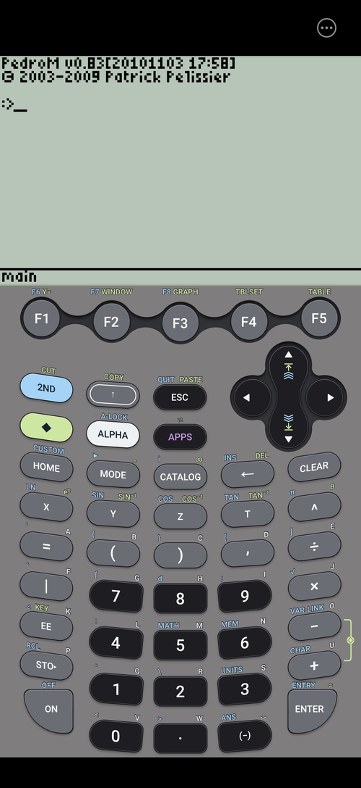
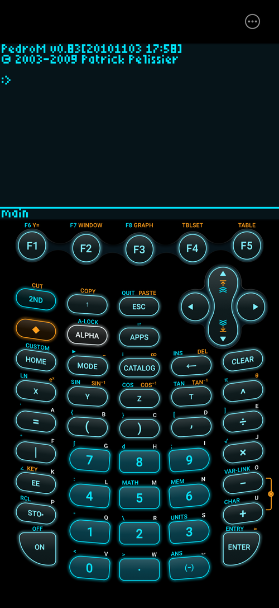
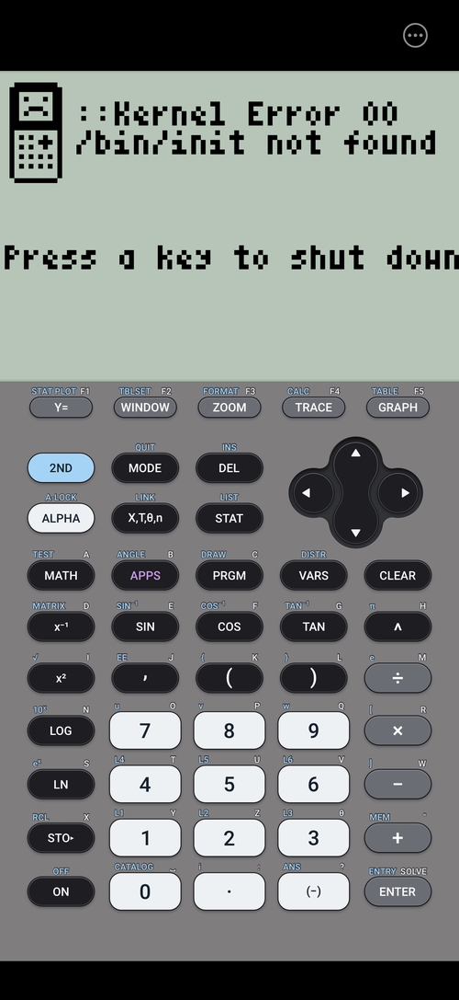
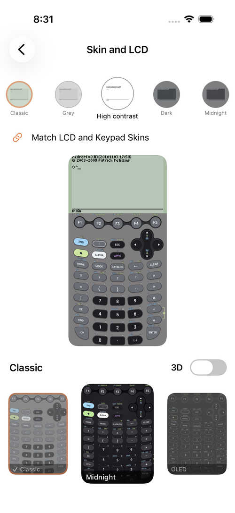

# Graph89 Remastered for iPhone

Emulator for TI Series calculators (TI-89, TI-89 Titanium, TI-84 Plus, TI-84 Plus SE, TI-83, TI-83 Plus, TI-83 Plus SE) on iPhone. A native SwiftUI port of [Graph89 Remastered for Android](https://github.com/jameskho512/graph89-remastered), running the same emulator cores. Based on Graph89 by Dritan Hashorva.

The app does not include any Texas Instruments software. You supply the OS or ROM of your own calculator.

<p align="center">
  
  &nbsp;
  
  &nbsp;
  
  &nbsp;
  
</p>
<p align="center"><em>The screenshots run free operating systems (PedroM, KnightOS) used by the app's tests.</em></p>

Disclaimer: I made this as a fun side project during my free time. Agentic development was used to help port the Kotlin app to Swift.

## Features

- File transfer: send programs, apps and variables to the calculator; save the files it sends
- Multiple calculators, each with its own saved state
- Modern skins! Drawn at the screen's native resolution, each with an optional 3D mode
- LCD colour schemes that match the skins, or custom colours
- Save state on exit, clock sync, adjustable CPU speed, key vibration and click sound

## Installing

The app is not on the App Store. Each [release](https://github.com/jameskho512/graph89-remastered-ios/releases) has an unsigned `Graph89.ipa`, which you install with [AltStore](https://altstore.io) or [SideStore](https://sidestore.io) and your own Apple ID:

1. Set up AltStore (with AltServer on a Mac or Windows PC) or SideStore on your iPhone.
2. Download `Graph89.ipa` to the iPhone, open AltStore or SideStore, and add it under My Apps.
3. On iOS 16 and later, turn on Developer Mode when iOS asks (Settings > Privacy & Security > Developer Mode).

With a free Apple ID the app has to be refreshed in AltStore or SideStore every 7 days. Your calculators and their saved states stay when it is refreshed or updated.

## Using it

- **Add a calculator:** tap Add calculator, pick the model, then choose your OS upgrade file (`.89u`, `.8xu`) or ROM dump (`.rom`) in Files.
- **Menu:** the ••• button above the calculator, or touch and hold the screen. It opens Settings and the calculator list.
- **Turning off:** [2ND] [ON] turns the calculator off, saves it and shows the calculator list (Settings can turn this off).
- **Files:** Settings > Send files. A file the calculator sends (TI-89 family) can be saved to Files.

## Building

The iPhone app is in `ios/`. Its Xcode project is generated with [XcodeGen](https://github.com/yonaskolb/XcodeGen) from `ios/project.yml`; the emulator cores are compiled from the same C sources as the Android app (`app/src/main/jni`), see `ios/scripts/gen_core_targets.py`. On a Mac with Xcode 16 or later:

```
brew install xcodegen
cd ios && xcodegen generate && open Graph89.xcodeproj
```

Without a Mac, GitHub Actions builds and tests every push (`.github/workflows/ios.yml`): the emulators run free operating systems (PedroM for the TI-89 family, the KnightOS kernel for the TI-83 Plus and TI-84 Plus family, fetched by `ios/scripts/fetch-test-os.sh`), and the screenshots and the `.ipa` are kept as artifacts. A tag `v*` publishes a release with the `.ipa`.

The Android app is still in `app/` (see the [Android repository](https://github.com/jameskho512/graph89-remastered) to build it).

## License

[GNU General Public License v3.0](LICENSE). Graph89 Remastered includes:

- Graph89, Copyright (C) 2012-2013 Dritan Hashorva (GPL 3)
- TilEm 2.0, Copyright (C) 2009-2012 Benjamin Moody (GPL 3)
- TiEmu 3.03, Copyright (C) 2000-2006 Thomas Corvazier, Romain Liévin, Julien Blache, Kevin Kofler (GPL 2 or later)
- libticalcs2, libtifiles2, libticables2, libticonv, Copyright (C) 1999-2006 Romain Liévin, Kevin Kofler (GPL 2 or later)
- GLib, Copyright (C) The GLib team (LGPL 2 or later)
- Roboto (Apache 2.0) and Noto Sans Symbols (SIL Open Font License 1.1), Copyright (C) Google

Not affiliated with or endorsed by Texas Instruments. TI-83, TI-84 Plus, TI-89 and TI-89 Titanium are trademarks of Texas Instruments.

<a href="https://www.buymeacoffee.com/j.ho"></a>
